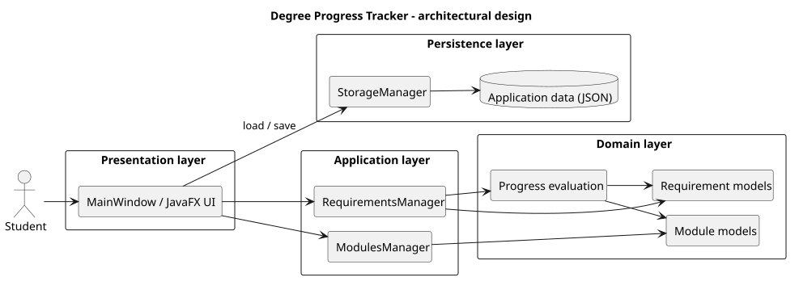

# Developer Guide

This guide describes the current implementation of Degree Progress Tracker
(build version `0.1.0-SNAPSHOT`). It is written for contributors who need to
understand the design, extend the domain model, or reproduce a development and
release build.

## Architectural design

### System overview

Degree Progress Tracker is a JavaFX desktop application with four logical
layers:

1. The JavaFX presentation layer displays modules and the editable requirement
   tree. It translates user actions into calls to the managers and displays
   returned domain results.
2. The application layer consists of `ModulesManager` and
   `RequirementsManager`. The managers own the in-memory application state and
   expose module and requirement use cases to the presentation layer.
3. The domain layer contains module records, the requirement hierarchy,
   selectors, evaluation results, and the allocation algorithm. It has no
   dependency on JavaFX or file-system details.
4. The persistence layer converts domain documents to and from JSON and owns
   the application data file. It is used by the application entry point and
   does not know about JavaFX controls.

The design uses a dependency direction of presentation to managers to domain.
Persistence is coordinated by `MainWindow` at application startup and after
successful mutations; domain objects do not call persistence themselves.

### Component diagram

The following diagram shows the main runtime components and their dependency
direction. The `UniversalLauncher` is only involved when the packaged
universal JAR is executed.




### Presentation layer

`Launcher` is the normal executable entry point and starts `MainWindow`, which
is the JavaFX application coordinator. During startup, `MainWindow`:

1. creates a `StorageManager`;
2. loads an `ApplicationData` aggregate;
3. creates `ModulesManager` and `RequirementsManager` from the loaded
   documents; and
4. constructs the three main UI areas.

The UI is split into focused components:

- `ModulesPanel` displays module rows, performs module searches through
  `ModulesManager.searchModules`, and opens `ModuleDialog` for add/edit flows.
  Completion changes and deletion are delegated to the manager.
- `RequirementsPanel` displays the root and child requirements in a
  `TreeView`. It obtains one `EvaluationAllocation` snapshot per refresh so
  that completion indicators use the same allocation decision as the details
  view.
- `RequirementDetailsPanel` displays the selected requirement's progress,
  metadata, selector information, children, and applicable credited modules.
  It delegates editing, child insertion, and deletion to
  `RequirementsManager`.
- `RequirementDialog` is shared by root creation, child creation, and editing.
  It pre-populates edit forms, preserves IDs, validates input, and restricts
  type changes to those supported by `RequirementsManager`.
- `ApplicationToolbar` exposes the save and exit actions. `MainWindow`
  coordinates the save callback after a successful mutation in either manager.

Controllers and views do not contain requirement-evaluation rules, JSON
parsing, or file-location logic. They only translate UI events into manager
calls and render the returned state.

### Application layer

`ModulesManager` owns the current module list. It provides:

- add, edit, and delete operations;
- case-insensitive substring search over module codes and names;
- completion-state changes; and
- immutable snapshots for evaluation and persistence.

`ModuleCode` normalizes module codes to uppercase and validates their shape.
It also derives the alphabetic prefix and level from the code, so `Module`
does not store duplicate derived fields. Module identity is the normalized
code, and duplicate codes are rejected by both the manager and
`ModuleDocument`.

`RequirementsManager` owns the root requirement list and its nested children.
It provides add, edit, delete, child-management, root lookup, and evaluation
operations. It validates unique IDs and delegates progress calculation to
`RequirementAllocationEngine`; it does not reimplement the rules of the
requirement subclasses.

### Domain model and evaluation

The requirement model is a polymorphic tree:

- `Requirement` stores the stable ID, name, description, and evaluation
  contract.
- `ModuleRequirement` requires every module code in an explicit set to be
  completed.
- `ModuleCountRequirement` counts completed modules matching a
  `ModuleSelector` and applies a minimum and optional maximum.
- `UnitCountRequirement` sums units from completed modules matching a selector
  and applies a minimum and optional maximum.
- `CompositeRequirement` evaluates children using a shared context.
  `AllOfRequirement` requires every child; `AnyOfRequirement` requires at least
  one child.
- `EvaluationResult` is an immutable tree of calculated progress. A
  `DegreeProgress` value aggregates the root results.

`ModuleSelector` supports optional exact module codes, code prefixes, minimum
level, and maximum level. All populated fields must match. An empty selector
matches every completed module.

#### Allocation design

Requirement progress is evaluated only from completed modules. A normal root
is classified as `SPECIFIC`; two stable bundled IDs provide special behavior:

- `unrestricted-electives` receives completed modules left after specific
  roots have claimed their modules.
- `degree-total` evaluates all completed modules without consuming them from
  any other requirement.

`RequirementAllocationEngine` calculates a single runtime allocation and
returns an `EvaluationAllocation` containing root results, descendant results,
and credited module codes. The allocation is not persisted as user data.

The engine applies these rules:

1. A module code listed by a `ModuleRequirement` is an explicit claim. It is
   removed from broad module-count and unit-count scopes.
2. A non-explicit completed module can be claimed by at most one specific root.
   The same module can be reused across specific roots only when it is
   explicitly listed in each relevant `ModuleRequirement`.
3. A composite requirement shares its selected module pool with its children.
   Broad count leaves receive a scoped pool with explicit claims removed.
4. The unrestricted-elective root is evaluated against the remaining completed
   modules. Its configured minimum and optional maximum remain ordinary
   `UnitCountRequirement` fields.
5. For small candidate pools, the engine performs a deterministic exact search.
   For larger pools, it uses deterministic greedy selection followed by
   redundant-module removal. It prefers a fulfilled allocation, then prefers
   an allocation that uses fewer units and fewer modules, with module-code order
   as a final tie-breaker.

The presentation layer consumes the same allocation snapshot for tree
completion indicators and requirement details. A leaf displays its own
credited modules; a composite displays the union of its children's
allocations. Specific-module leaves already show their required codes directly
and therefore do not display a redundant allocation section.

### Persistence layer

`ApplicationData` is the persisted aggregate. It contains one application
schema version, a `ModuleDocument`, and a `RequirementDocument` containing
programme metadata, source URLs, and root requirements. The serializers are
format-specific converters only:

- `ModuleSerializer` converts module documents with `code`, `name`, `units`,
  and `completed` fields.
- `RequirementsSerializer` preserves the requirement subclass hierarchy using
  a JSON `type` discriminator (`module`, `moduleCount`, `unitCount`, `allOf`,
  or `anyOf`) and serializes selectors and child lists.
- `StorageManager` owns file access, schema checks, default-resource loading,
  and save failure handling.

The default data file is `application-data.json` beside the packaged
application code source. `StorageManager` saves through a temporary sibling
file and moves it into place, using an atomic move when the platform supports
one. On first launch, a missing user file loads the bundled default module and
requirement resources without creating a user file automatically.

If the existing JSON is malformed, has invalid fields, or uses an unsupported
schema version, `loadWithStatus()` returns the bundled defaults together with a
corruption flag. `MainWindow` displays the affected path and warning before
showing the application. The original file is not repaired or overwritten by
the fallback load itself; a later save can replace it, so users should back up
the file when recovery is needed.

### Release and runtime bootstrap

The normal development entry point uses the JavaFX runtime selected by Gradle.
The `universalJar` task creates one self-contained release JAR containing the
application, Jackson, and separate JavaFX runtime JARs under
`platform/<platform>/`. `UniversalLauncher` detects the operating system and
architecture, extracts only the matching JavaFX JARs to a temporary directory,
and loads `degreeprogress.Launcher` through an isolated `URLClassLoader`. This
avoids placing conflicting platform-specific JavaFX classes on one flat
classpath.

The universal artifact supports Windows x64, Linux x86_64 and ARM64, and macOS
x86_64 and Apple Silicon. Linux requires GTK 3.20 or later for JavaFX. The
smaller `releaseJar` task can target `win`, `linux`, `linux-aarch64`, `mac`, or
`mac-aarch64` explicitly.

## Software engineering process

### Development approach

Development proceeded in small, vertical increments. Each increment was
implemented against the current architecture, verified with tests or a smoke
check, and recorded in `logs/` when it represented a meaningful
AI-assisted development decision. The main sequence was:

1. establish module and requirement domain models and manager operations;
2. add JavaFX module and requirement workflows around those manager APIs;
3. add selectors, requirement evaluation, and cross-root module allocation;
4. connect one shared evaluation snapshot to both requirement UI views;
5. add JSON serialization, default data, version validation, and corrupted-file
   fallback; and
6. package platform-specific JavaFX runtimes into a universal release JAR.

This sequence keeps domain behavior testable before it is exposed through the
GUI and makes persistence a boundary concern rather than a responsibility of
individual controls.

### Engineering practices

- **Single responsibility and dependency direction:** managers coordinate use
  cases, domain classes own business rules, serializers map formats, and JavaFX
  classes render state.
- **Validation at boundaries:** module codes, units, selectors, bounds,
  requirement IDs, duplicate identities, JSON fields, and schema versions are
  validated when values enter a layer.
- **Immutable transfer values:** managers return copied lists; document,
  result, progress, and allocation records defensively copy collections. This
  prevents a view or caller from silently changing the state being evaluated or
  saved.
- **One source of truth for evaluation:** `Requirement` subclasses implement
  their own evaluation rules, while the allocation engine supplies the scoped
  context. The UI never calculates a second version of the rules.
- **Deterministic behavior:** allocation candidate ordering, tie-breaking, and
  redundant-module removal are deterministic, which makes progress displays and
  regression tests repeatable.
- **Explicit failure reporting:** storage fallback is distinguishable from a
  missing first-launch file, and the UI warns the user instead of silently
  discarding an existing data file.
- **Documentation alongside decisions:** architecture changes and important
  trade-offs are recorded in the developer guide, data-format guide, user
  guide, reflections, and dated development notes.

### Testing strategy

The test suite uses JUnit 5 and follows the package structure of the production
code:

- model tests cover module validation, code normalization, selectors,
  requirement evaluation, evaluation contexts, allocation invariants, and
  degree-progress aggregation;
- manager tests cover module CRUD/search/completion behavior and requirement
  hierarchy editing and evaluation;
- serializer tests cover JSON round trips, subtype reconstruction, selectors,
  optional bounds, and invalid input; and
- `StorageManagerTest` covers default loading, save/load behavior, schema
  validation, malformed JSON, and corrupted-data fallback.

Test methods use the `featureUnderTest_testScenario_expectedBehavior` naming
convention, and Java production/test code follows the project’s SE-EDU-based
coding standard.

For a normal verification cycle, run:

```text
gradlew.bat clean test
```

Use `./gradlew` on macOS/Linux. Before a release, build and inspect the
universal artifact with:

```text
gradlew.bat clean test universalJar
```

The documented release verification includes a Windows launch smoke test and
inspection of the nested Linux and macOS runtime payloads. Full GUI launch
verification for Linux and macOS requires the corresponding native machines or
CI runners.

### Current limitations and design trade-offs

The model intentionally evaluates the user's current module records rather
than attempting to be an official graduation audit. It does not implement
prerequisites, cohort-specific conditional rules, GPA-dependent alternatives,
grades, semester information, what-if planning, or automatic NUS/NUSMods
updates. The bundled curriculum is an editable sample and documents its source
URLs in the requirement document.

Allocation is automatic and cannot be manually reassigned. While this provides the convenience of automatic checking, certain complex assignments for module to requirement mapping will not be possible.

The exact search is bounded to small candidate pools and the larger-pool greedy path may not find a globally optimal allocation in complex overlapping cases. These trade-offs keep
the runtime predictable while leaving the allocation policy isolated for future
improvements.

## Prerequisites, build, and run

- Java SE 25
- Gradle 9.1 or later when running with Java 25
- The committed Gradle Wrapper (Gradle 9.1.0) may be used instead of a system
  Gradle installation.

Run the application with:

```text
gradlew.bat run
```

On macOS/Linux, use `./gradlew run`.

The project uses JavaFX `25.0.2`, Jackson Databind `2.19.2`, and JUnit 5 for
testing. Gradle downloads the required dependencies when they are not already
available locally.

## Acknowledgements

The application code and this guide are maintained for this project. No
external application source code was copied into the implementation, but most of the code implementation is generated by LLM (ChatGPT Codex) under extensive human supervision. The
following material was reused or adapted and is acknowledged here:

| Material | Use in this project |
| --- | --- |
| [NUS Computing BComp Computer Science curriculum](https://www.comp.nus.edu.sg/programmes/ug/cs/curr/) | Source for the bundled programme structure and representative Computer Science requirements. |
| [NUS Computing Common Curriculum](https://www.comp.nus.edu.sg/cug/soc-22-23/) | Source for the common-curriculum and interdisciplinary/cross-disciplinary examples. |
| [NUS Computing focus areas](https://www.comp.nus.edu.sg/programmes/ug/focus/) | Source for the representative Artificial Intelligence and Software Engineering focus-area module lists. |
| [NUS approved GE pillar courses](https://www.nus.edu.sg/registrar/academic-information-policies/undergraduate-students/general-education/list-of-courses-approved-under-the-ge-pillars) | Source for the representative General Education pillar examples. |
| [SE-EDU Java coding standard](https://se-education.org/guides/conventions/java/intermediate.html) | Basis for Java naming, layout, Javadoc, and JUnit test-naming conventions used by the project. |
| [JavaFX / OpenJFX](https://openjfx.io/), [Jackson](https://github.com/FasterXML/jackson), [JUnit 5](https://junit.org/junit5/), and [Gradle](https://gradle.org/) | Third-party runtime, JSON, testing, and build tooling used through declared dependencies and the Gradle Wrapper; no library source was copied into the application. |
| [PlantUML](https://plantuml.com/) and its [SVG output documentation](https://plantuml.com/svg) | Syntax and SVG rendering tooling used for the architecture diagram; the editable source and rendering setup are kept under docs/assets/diagrams. |
| [Existing project source and documentation](../src/main/java/degreeprogress/), [`AGENTS.md`](../AGENTS.md), [`docs/UserGuide.md`](UserGuide.md), and [`docs/RequirementDataFormat.md`](RequirementDataFormat.md) | Existing project material consulted and paraphrased to keep this guide consistent with the implemented design and current product behavior. |
| [AI-assisted development notes](../logs/) | The implementation and documentation were developed with AI assistance; the dated notes record the prompts, decisions, trade-offs, and verification associated with the major increments. |

The curriculum links and their limitations are also recorded in
[`docs/RequirementDataFormat.md`](RequirementDataFormat.md). The dated
AI-assisted implementation decisions are recorded in
[`logs/`](../logs/), including the module GUI/search work, requirement editing
and allocation work, corrupted-storage fallback, and universal-JAR packaging.
