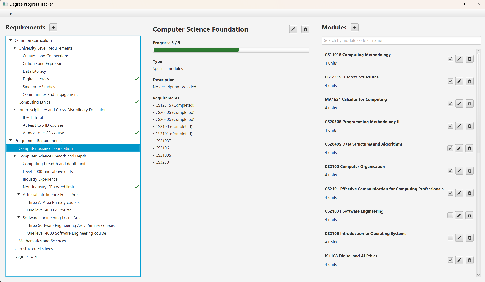

# User Guide

## Overview

Degree Progress Tracker is a JavaFX desktop application that helps NUS
Computing students keep track of their progress towards a degree. Its purpose
is to bring module records and degree requirements together in one place, so
that students can see which requirements have been met and what remains to be
completed.

The application lets you:

- record, search, edit, and delete modules, including their module codes,
  names, units, and completion status;
- create and edit a personal hierarchy of degree requirements, including
  requirements for specific modules, a minimum number of modules, or a
  minimum number of units;
- view progress for an individual requirement and for the overall degree,
  including the modules credited towards a requirement; and
- save your module records and requirements locally so that your progress is
  available the next time you launch the application.

The application loads a default set of editable requirements on first launch.
You can then adapt the requirements to your own degree plan and update your
module completion status as you progress.



## Setup and launch

Install Java SE 25 and use the committed Gradle Wrapper. On Windows, run:

```text
gradlew.bat clean test
gradlew.bat run
```

On macOS/Linux, use `./gradlew` instead of `gradlew.bat`. JavaFX uses native
runtime binaries for the selected operating system. Linux systems must provide
GTK 3.20 or later.

To create the universal self-contained submission JAR:

```text
gradlew.bat clean test universalJar
```

The generated JAR is placed in `release/` and runs with Java SE 25 on supported
Windows, Linux, and macOS systems. See [Storage](#storage) for the location and
handling of the application data file.

## Features

The main window is divided into a Requirements panel, a requirement-details
panel, and a Modules panel. The features in each part of the application are
described below.

### Requirements

Requirements are displayed as an expandable hierarchy. A root requirement can
contain nested child requirements, making it possible to represent both simple
module rules and groups of related rules.

Use the requirements controls as follows:

- **Add a root requirement:** Select the **plus icon** at the top of the
  Requirements panel, enter the common fields, and choose a requirement type.
- **Add a child requirement:** Select a composite requirement and choose the
  **plus icon** in the requirement details panel. The child uses the same form
  as a root requirement.
- **View a requirement:** Select it to view its type, description, progress,
  and configured criteria.
- **Edit a requirement:** Select it and use the **pencil icon** in the details
  panel to change its name, description, or type-specific fields. Leaf
  requirement types cannot be changed. A composite requirement can be changed
  between **All child requirements** and **Any child requirement**; its
  existing children are preserved.
- **Delete a requirement:** Select it and use the **trash icon** in the details
  panel. The deletion must be confirmed. Deleting a composite requirement also
  deletes all of its children.

#### Common fields

Every requirement has the following fields:

- **Name:** Required display name for the requirement.
- **Description:** Optional explanation of what the requirement represents.
- **Type:** Required rule used to evaluate the requirement.

#### Requirement types

The available requirement types are:

- **Specific modules**
- **Module count**
- **Unit count**
- **All child requirements**
- **Any child requirement**

##### Specific modules

Requires every module in a specified list to be completed.

- **Module codes**: Required list of one or more module codes. Separate codes
  with commas or new lines.

##### Module count

Requires a number of completed modules that match the configured selector.

- **Minimum modules**: Minimum number of matching modules required. A blank
  value defaults to zero.
- **Maximum modules**: Optional upper bound on the number of modules credited
  to this requirement.
- **Matching module codes**: Optional list of exact module codes to match.
- **Module prefixes**: Optional list of prefixes to match, such as `CS` or
  `IFS`.
- **Minimum module level**: Optional lowest module level to match, such as
  `4000`.
- **Maximum module level**: Optional highest module level to match.

##### Unit count

Requires a number of units from completed modules that match the configured
selector. It has the same selector fields as **Module count**, but counts units
instead of modules.

- **Minimum units**: Minimum number of matching units required. A blank value
  defaults to zero.
- **Maximum units**: Optional upper bound on the units credited to this
  requirement.
- **Matching module codes**, **Module prefixes**, **Minimum module level**, and
  **Maximum module level**: Optional matching criteria applied to completed
  modules.

For both count types:

- All non-empty selector fields must match.
- If no selector criteria are provided, every completed module is eligible.
- Module levels are derived from the first digit of the module code; for
  example, `CS2040S` is a level-2000 module.
- Minimum and maximum values must be non-negative.
- A maximum cannot be lower than its minimum.

##### All child requirements

A composite requirement that is fulfilled only when every child requirement is
fulfilled. It has no additional fields. Add its child requirements after
creating it with the **plus icon** in the requirement details panel.

##### Any child requirement

A composite requirement that is fulfilled when at least one child requirement
is fulfilled. It has no additional fields. Add its child requirements after
creating it with the **plus icon** in the requirement details panel.

### Modules

The Modules panel stores the module records used for progress evaluation. Use
the module controls as follows:

- **Add a module:** Select the **plus icon** at the top of the panel and enter
  the module details.
- **Edit a module:** Select its **pencil icon**. Editing the code, name, or
  units preserves the module's completion status.
- **Delete a module:** Select its **trash icon**. Deletion must be confirmed
  and cannot be undone.
- **Change completion status:** Use the checkbox beside the module to mark it
  as completed or incomplete.

The module form contains these fields:

- **Module code:** Required unique code consisting of a letter prefix, a
  numeric level, and an optional letter suffix, such as `CS2040S`. Codes are
  normalized to uppercase.
- **Module name:** Required name displayed beside the module code.
- **Number of units:** Whole number from 1 to 60.
- **Completion status:** Whether the module has been completed. New modules
  are incomplete.

Other module features include:

- The module prefix and level used by requirement selectors are derived from
  the module code; they are not separate editable fields.
- The search box filters modules by a case-insensitive substring of their code
  or name.

### Progress

Progress is evaluated automatically; there is no separate evaluation command.
It is recalculated:

- when the window is loaded;
- when a requirement is selected; and
- after a module or requirement is added, edited, deleted, or marked
  complete/incomplete.

The interface displays progress as follows:

- The Requirements panel shows a green completion indicator for fulfilled
  requirements.
- The details panel shows an `achieved / target` value and progress bar for the
  selected requirement.

Only completed modules contribute to progress. The rules are evaluated as
follows:

- **Specific modules** counts how many listed module codes are completed and is
  fulfilled only when all listed modules are completed.
- **Module count** counts completed modules matching its selector and checks
  the minimum and optional maximum bounds.
- **Unit count** sums the units of completed modules matching its selector and
  checks the minimum and optional maximum bounds.
- **All child requirements** is fulfilled only when all of its children are
  fulfilled. **Any child requirement** is fulfilled when at least one child is
  fulfilled.

When several root requirements could use the same module, the application
allocates modules using these rules:

- Explicitly listed modules are reserved for **Specific modules**
  requirements.
- Other completed modules are credited to at most one ordinary root
  requirement at a time.
- Completed modules left over after these allocations are credited to
  **Unrestricted Electives**, if that requirement exists.
- The default **Degree Total** requirement observes all completed modules
  without reserving them for another requirement.

The overall degree is fulfilled only when all root requirements are fulfilled.

### Storage

The application stores the complete state in one JSON file named
`application-data.json`. Storage works as follows:

- **Data stored:** Recorded modules, their completion statuses, the requirement
  hierarchy, and requirement-document metadata.
- **File location:** Beside the packaged application JAR. When running through
  the Gradle development task, it is beside the application code source used
  to launch the program.
- **Automatic saving:** Changes are saved after every successful module or
  requirement mutation.
- **Manual saving:** Use **File > Save** or press **Ctrl+S**.
- **Exiting:** **File > Exit** closes the application.
- **Loading:** At startup, an existing JSON file is loaded if it is present and
  valid. If no file exists, the bundled default modules and editable
  requirements are loaded.
- **First save:** The file is written when the application first saves data;
  simply launching the application with no changes does not necessarily create
  it.
- **Corrupted data:** If the file is malformed, contains invalid data, or uses
  an unsupported schema version, the application reports a warning and loads
  the bundled defaults instead. The original file is not automatically
  repaired or renamed, but a later save can overwrite it.
- **Recovery advice:** Make a backup of the file before attempting to recover
  corrupted data. If a save fails, the application displays an error and the
  change may not have been persisted.

The bundled requirements and modules are sample, non-exhaustive data for
demonstration. They are editable and should not be treated as an authoritative
curriculum or a substitute for checking the requirements that apply to you.

## Current limitations

The current release has the following limitations, some of which mention potential features which are out of scope of the current version of the application:

- **Curriculum coverage:**
  - The bundled requirements and modules are a small, editable demonstration
    dataset rather than a complete or authoritative NUS Computing curriculum.
  - The application does not automatically import or update curriculum data
    from NUS or NUSMods.
  - Users must manually configure changes to their programme, cohort, focus
    area, or other applicable degree rules.

- **Planning and academic rules:**
  - Prerequisite checking is not supported.
  - Cohort-specific or conditional curriculum rules are not supported.
  - What-if planning is not supported; the application evaluates the current
    module records only.
  - Module records currently contain a code, name, unit count, and completion
    status. Grades, GPA, semesters, and transcript information are not used in
    progress evaluation.

- **Requirements/Module configuration:**
  - Only the five requirement types described in this guide are available.
  - Leaf requirement types cannot be converted to another leaf type after
    creation. Composite requirements can only switch between **All child
    requirements** and **Any child requirement**. This limitation exists due to the potentially complex nature of requirements.
  - Requirements have no manual ordering or module-credit override controls.
  - Editing or deleting a module does not automatically update module codes
    stored in **Specific modules** requirements.
  - Deleting a requirement or module cannot be undone within the application.

- **Progress evaluation:**
  - A module can be credited to only one ordinary broad root requirement at a
    time. When requirements overlap, the automatic allocation policy decides
    where the module is counted; users cannot manually reassign it.
  - In complex overlapping cases of requirements or requirements involving `maximum` module or unit count, the credited modules to requirements assignment may not be the globally optimal allocation.
  - Overall degree progress is the result of the configured root requirements;
    it does not independently verify official graduation rules.

- **Storage and portability:**
  - If the data file is corrupted, the application loads bundled defaults, but
    it does not automatically repair, rename, or preserve a separate recovery
    copy of the original file.
  - A later save may overwrite the corrupted file, so users should back up the
    file before attempting recovery.
  - Saving can fail if the application directory is not writable or the file is
    unavailable; a failed save means the latest changes may not have been
    persisted.
